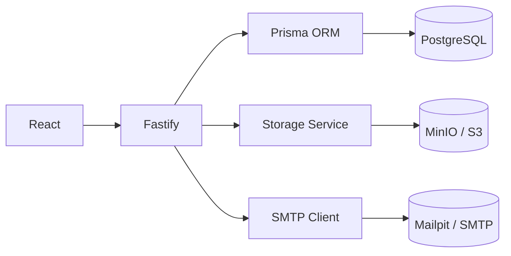

# Referência — Seção 4: Arquitetura

A seção de arquitetura deve explicar como o sistema funciona por dentro. Ela pode conter:
- Diagrama.
- Estrutura de pastas.
- Fluxo de dados.
- Componentes principais.
- Banco de dados.
- Serviços externos.
- Decisões técnicas relevantes.

Mantenha esta seção descritiva e enxuta. Se o projeto já tiver documentação técnica em `docs/`, resuma os componentes principais e linke para o documento em vez de reproduzir todo o runbook.

> **Atenção:** O modelo abaixo (diagrama Mermaid e estrutura de pastas) usa uma stack ilustrativa (React + Fastify + Prisma + PostgreSQL + MinIO/S3). Substitua pelos componentes, serviços, bancos e diretórios **reais** do projeto analisado — não copie a stack do exemplo.

## Modelo

~~~markdown
## 🏗️ Arquitetura



### Estrutura de Diretórios

```text
.
├── backend/            # API, Prisma, domínios (auth, category, transaction, storage)
│   └── tests/          # Testes automatizados de API
├── frontend/           # App React, páginas protegidas
│   └── tests/e2e/      # Testes E2E unificados
│       ├── fixtures/   # Dados de seed (avatar, etc.)
│       ├── helpers/    # Utilitários
│       ├── support/    # Setup global e hooks de teste
│       ├── reference/  # Snapshots visuais de referência (versionados)
│       ├── results/    # Artefatos de execução (gitignored)
│       └── report/     # Relatório HTML do Playwright (gitignored)
├── scripts/            # Orquestração E2E e utilitários de ambiente
└── .github/            # Workflows de CI, hooks e template de PR
```
~~~
